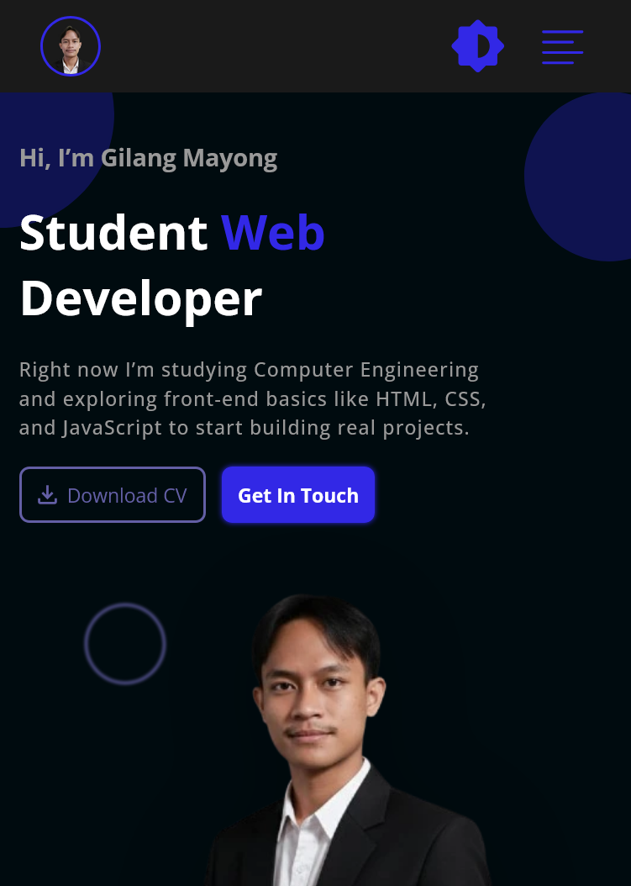
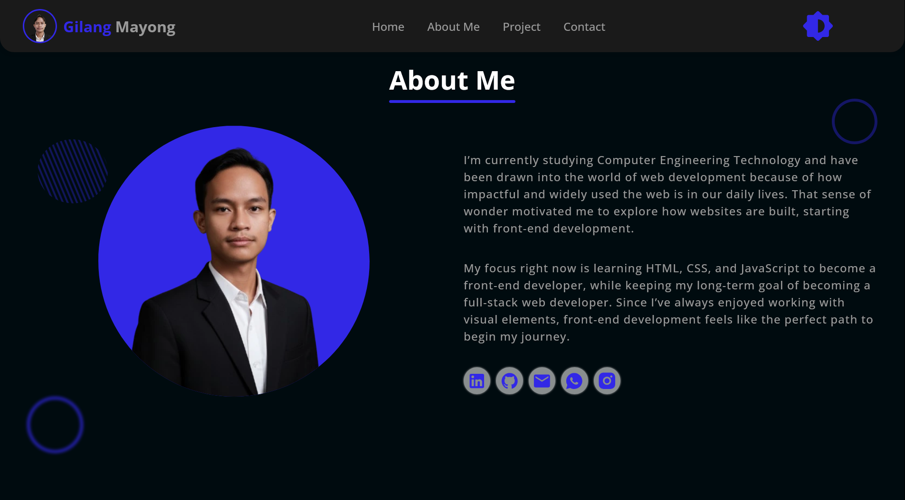

# gilang-mayong-portfolio

---

## 📌 General Information
Gilang-Mayong-Portfolio is a personal portfolio website created using **HTML, CSS, and JavaScript**.  
The main purpose of this project is to:  
- Practice and improve my web development skills.  
- Showcase my projects, abilities, and experiences.  
- Build a personal portfolio that can be used for learning and professional growth.  

---

## ✨ Features
This portfolio website includes several sections and interactive features:  

### Sections
- **Hero Section** – The landing section with an introduction and a strong first impression.   
- **About Section** – A short description about myself, my background, and my goals.  
- **Projects Section** – A showcase of my projects with previews.   
- **Contact Form** – A simple form to get in touch with me easily.  

### Functionality
- **Dark Mode** – Users can switch between light and dark theme for better accessibility.   
- **Animations** – Smooth animations for a modern and engaging user experience.  
- **Responsive Design** – Fully optimized for desktop, and mobile devices.  
  
---

## 📷 Preview
Here is a preview of the portfolio website:  
  
  
  


---

## 🚀 Usage
This project is a **static website** built only with HTML, CSS, and JavaScript.  
That means it does not require any additional setup or installation.  

### Steps to Run the Project:
1. Clone this repository:
````
   git clone https://github.com/your-username/Gilang-Mayong-Portfolio.git
````

2. Open the project folder.  
3. Double-click on the `index.html` file to open it in your browser.  

That’s it! The website will run directly without the need for npm or other dependencies.

---

## 🌐 Deployment

This portfolio is deployed using **GitHub Pages**.  
You can access it online here:  
👉 [Live Demo](https://mayongputra14.github.io/gilang-mayong-portfolio/)  

---

## 📜 License

This project is publicly available but intended mainly as a **personal portfolio**. You are welcome to view the code for learning purposes, but **please do not copy, redistribute, or use it directly** as your own portfolio.

---

## 🙌 Acknowledgments

This project is part of my learning journey as a web developer.
Special thanks to online resources, tutorials, and documentation that helped me along the way.